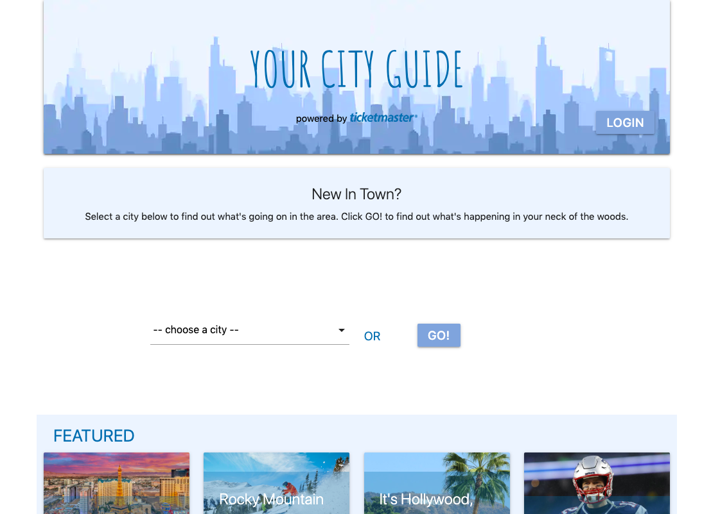
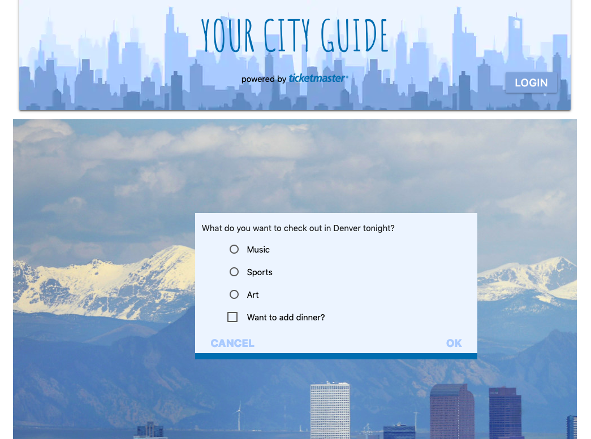
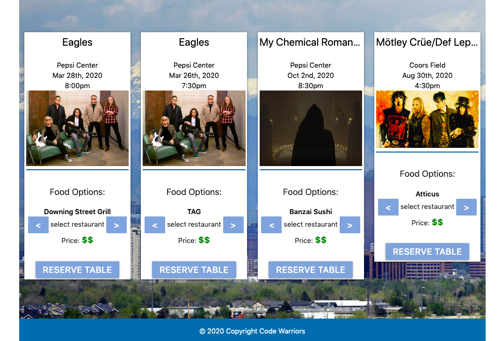

# YOUR CITY GUIDE

A Dynamic Web Application

Created as Project 1 during DU Coding Bootcamp. The challenge was to create a web application that included a minimum of 2 server-side APIs, using AJAX to pull data and a polished UI that utilizes a new CSS framework.

## User Story

- AS A person visiting a new city
- I WANT to be able to search for current events and locate nearby restaurants
- SO THAT I may find desired entertainment, as well as somewhere to dine, all within a convenient location.

## Overview

YOUR CITY GUIDE is an application that assists the user in finding local events and dining options. As soon as the user selects a city from the drop down, they are then able to filter the type of entertainment (music, sports or art) that they are seeking, as well as select an option for local restaurants. YOUR CITY GUIDE then provides upcoming events and local restaurants relevant to the user's input. It utilizes a clean, easy-to-use interface that makes finding a good time in a new city quick and simple.

## Utilizing the App

- View the app: [Here](https://tomatoma891.github.io/Project-1/ "Here")
- User clicks "Choose a City" OR 'Go' to find local events relevant to their current location
- User then selects 'Music', 'Sports' or 'Art' to identify the type of entertainment they are seeking.
- User can also select whether they would like to 'add dinner' to their search criteria
- According to user input; 4 different local entertainment and dining options will append to the page.
- User can click each 'event' which will then direct them to Ticketmaster where they can purchase tickets.
- User can also scroll through restaurant options, with the availbility to see a restaurant's price point, and click 'Reserve Table' where they will be redirected to OpenTable to make a reservation.

## Demonstrations

## Landing Page:

## Search:

## Results:

## Tech used

- HTML
- CSS
- Materialize
- Javascript
- jQuery
- Ticketmaster API
- OpenTable API

## Contributers

- **Matthew Grove**
- **Steven Jones**
- **Jen Mullin**
- **Tamara Sidorova**

